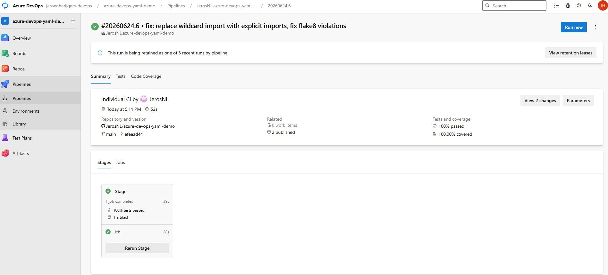
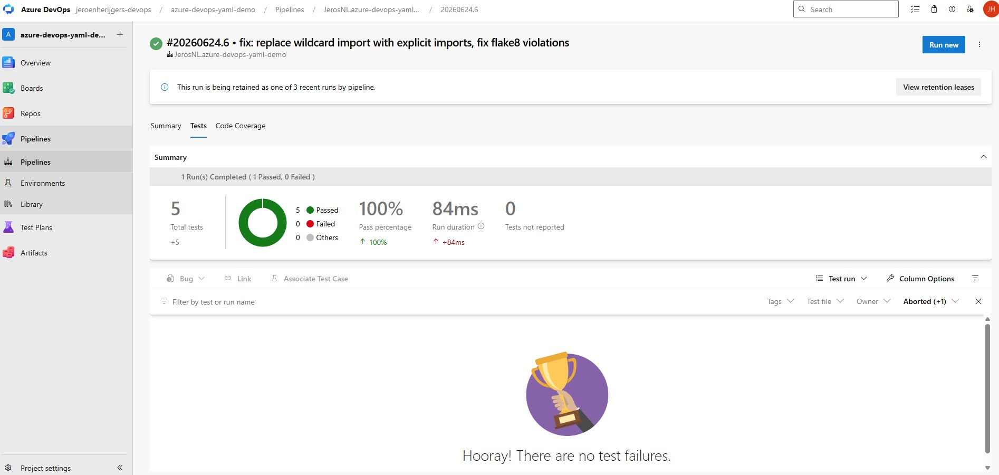
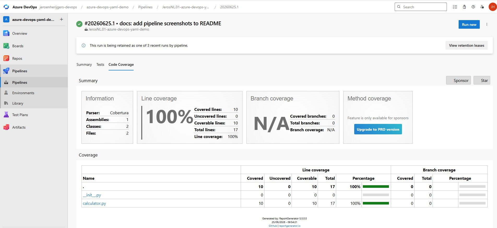

# Azure DevOps CI Pipeline Demo


## What this is

A Python calculator app with a CI pipeline built in Azure DevOps. This is my first hands-on DevOps project, built to learn how pipelines work in practice.

## What the pipeline does

```
GitHub Push -> Install dependencies -> Lint with flake8 -> Run tests -> Publish results -> Publish artifact
```

## What I learned

- How to write a YAML pipeline and connect it to a GitHub repository
- Self-hosted agents run as a Windows service on your own machine, no VM is created
- Calling `python -m pytest` instead of `pytest` directly avoids PATH issues on Windows agents
- flake8 catches code style violations before tests even run, which is the right order
- New Azure DevOps organisations do not automatically get free Microsoft-hosted parallelism, a manual grant request is required

## Tech used

- Python, pytest, flake8
- Azure DevOps Pipelines
- Self-hosted Windows agent

## Screenshots



